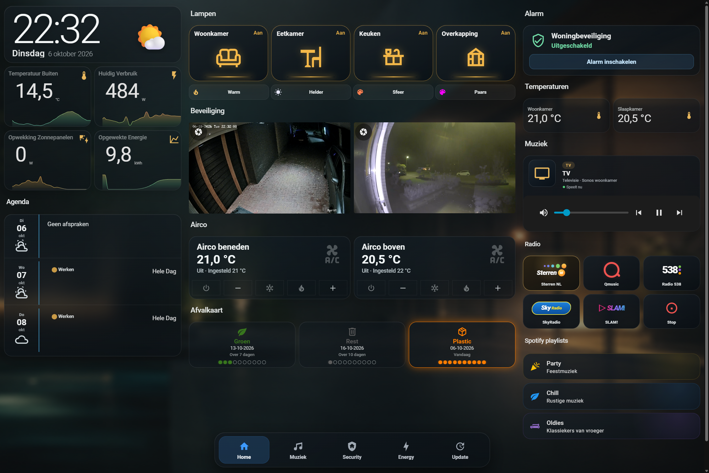
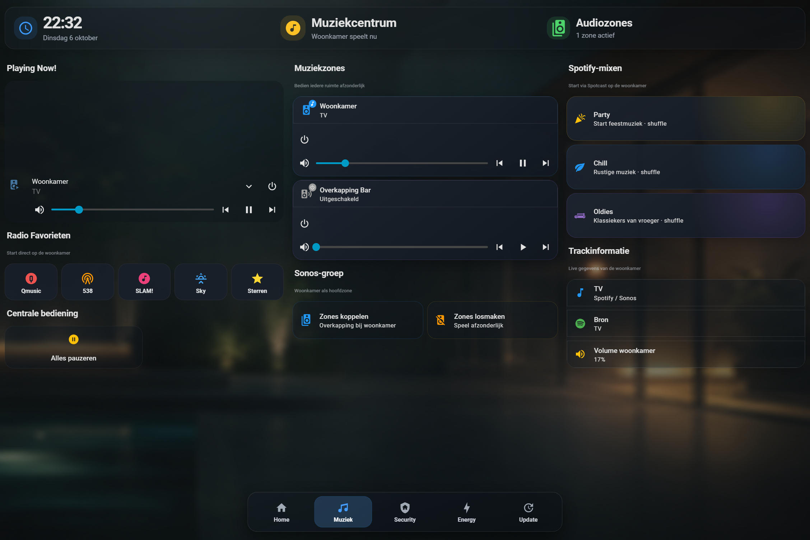
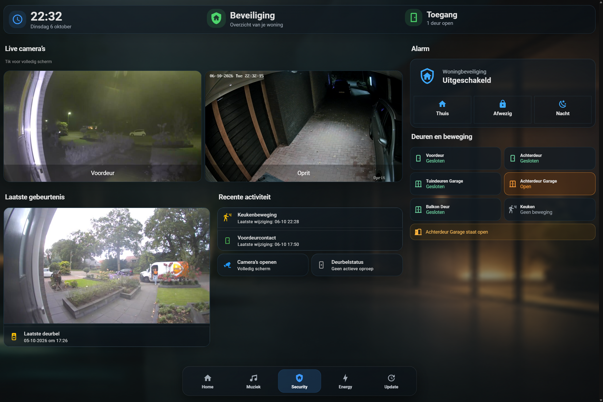
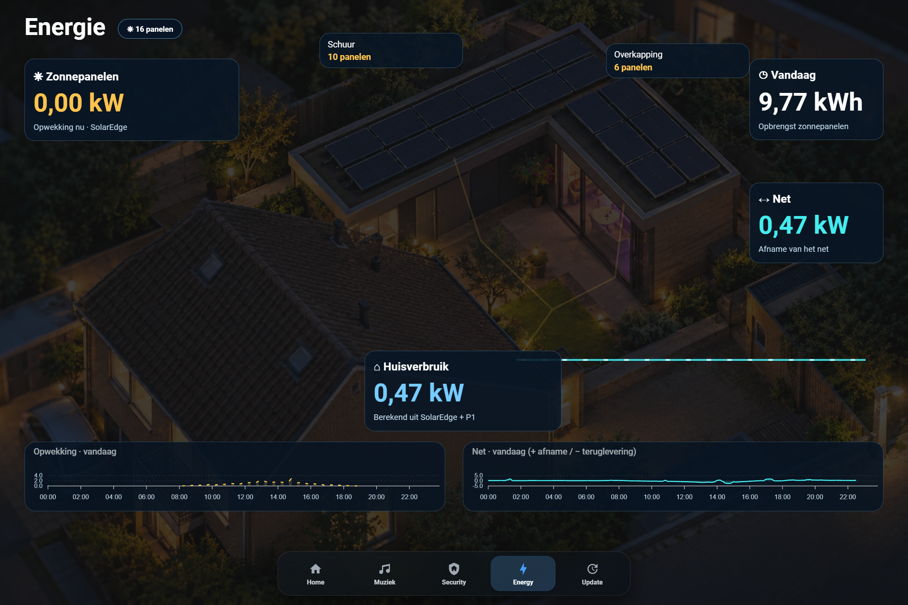
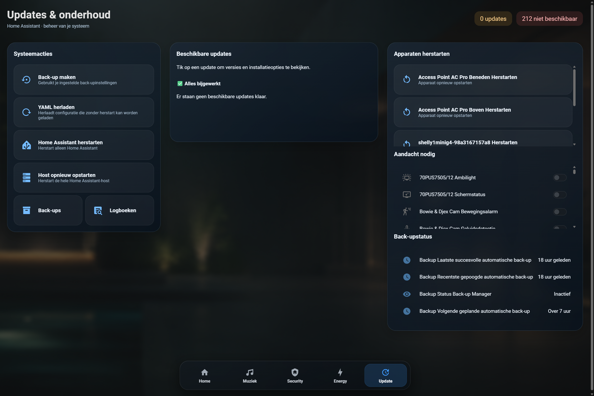

# 🏠 Home Assistant Glass Wallmount Dashboard


A custom **Home Assistant wallmount dashboard** with a modern glass-style interface for lighting, climate, media, cameras, energy, calendar, waste collection and security.

> ✨ Designed for a fixed wallmount display, but responsive enough to adapt to smaller screens.

---

## 📸 Screenshots

### 🏠 Home


### 🎵 Music


### 🛡️ Security


### ⚡ Energy


### 🔄 Updates


> 📱 Screenshots shown above are from the wallmount dashboard in use.

---

## ✨ Features

- 🏠 Responsive wallmount layout
- 🪟 Glass-style / glassmorphism interface
- 💡 Lighting control with scenes and popups
- ❄️ Climate / air-conditioning controls
- 📷 Live camera views
- 🎵 Sonos / media controls
- ⚡ Energy and solar information
- 📅 Calendar overview
- ♻️ Waste collection cards
- 🛡️ Alarm / security overview
- 🧭 Custom bottom navigation
- 🌙 Screensaver support

---

## 🚀 Installation

1. 📦 Install the required custom cards through **HACS**.
2. 🏠 Create a new Home Assistant dashboard.
3. ✏️ Open the **Raw Configuration Editor**.
4. 📋 Copy the contents of `dashboard.yaml` into the dashboard.
5. 🔄 Replace the example entity IDs with your own Home Assistant entities.
6. 🖼️ Add your own dashboard background at:

```text
/config/www/dashboard-background.png
```

or change the background path in the YAML.

---

## 📦 Required custom cards / integrations

This dashboard uses several custom Home Assistant frontend components:

- 🔘 Button Card
- 🍄 Mushroom
- 📐 Layout Card
- 📈 Mini Graph Card
- 🎵 Mini Media Player
- 🗂️ Stack In Card
- 🔎 Auto Entities
- 📅 Atomic Calendar Revive
- 📷 Advanced Camera Card
- 🎨 Card Mod
- 🪟 Browser Mod

Depending on your setup, additional integrations may be required for specific entities such as:

- ☀️ SolarEdge
- 🛡️ Alarmo
- 📷 Cameras
- ♻️ Waste collection
- ❄️ Climate devices
- 🎵 Media players

---

## 🔄 Entity IDs

The published configuration contains example entity IDs. Replace them with the corresponding entities from your own Home Assistant installation.

Example:

```yaml
light.woonkamer
light.keuken
climate.airco_beneden
camera.oprit
calendar.personal
sensor.p1_actueel_vermogen
sensor.afval_gft
```

> 💡 Tip: use **Developer Tools → States** in Home Assistant to find your own entity IDs.

---

## 🎵 Spotify playlists

The YAML contains placeholder Spotify playlist IDs:

```text
YOUR_PARTY_PLAYLIST_ID
YOUR_CHILL_PLAYLIST_ID
YOUR_LOUNGE_PLAYLIST_ID
```

Replace these with your own Spotify playlist IDs if you use those controls.

---

## 🖼️ Background image

The public version expects a background image at:

```text
/config/www/dashboard-background.png
```

which is referenced from Lovelace as:

```text
/local/dashboard-background.png
```

The original personal background image is intentionally not included.

---

## 🌙 Screensaver

The dashboard includes screensaver support and expects local images such as:

```text
/config/www/screensaver/foto1.jpg
/config/www/screensaver/foto2.jpg
...
/config/www/screensaver/foto19.jpg
```

You can replace these with your own photos or adjust the YAML to use fewer images.

---

## 🛡️ Security & privacy

Before publishing your own version, make sure you do **not** commit:

- 🔑 API keys
- 🔐 Passwords
- 🎟️ Access tokens
- 🪝 Webhook secrets
- 🌐 Private URLs
- 📡 MQTT credentials
- 📷 Personal camera snapshots
- 👤 Home Assistant user IDs

This repository contains the sanitized public/template version of my dashboard.

---

## 📁 Repository structure

```text
home-assistant-wallmount-dashboard/
│
├── README.md
├── dashboard.yaml
├── LICENSE
├── .gitignore
│
└── screenshots/
    ├── home.png
    ├── music.png
    ├── security.png
    ├── energy.png
    └── update.png
```

---

## 📝 Notes

This dashboard was built for a specific Home Assistant environment, so some configuration changes will always be necessary before it works in another installation.

The goal of this repository is to provide a complete starting point that you can adapt to your own smart home.

---

## 🤝 Contributions

Suggestions, improvements and pull requests are welcome.

If you build your own version based on this dashboard, feel free to share screenshots or ideas.

---

## ⭐ Like it?

If this dashboard helped or inspired you, consider giving the repository a **star** ⭐

---

## 📄 License

MIT License. See `LICENSE`.
